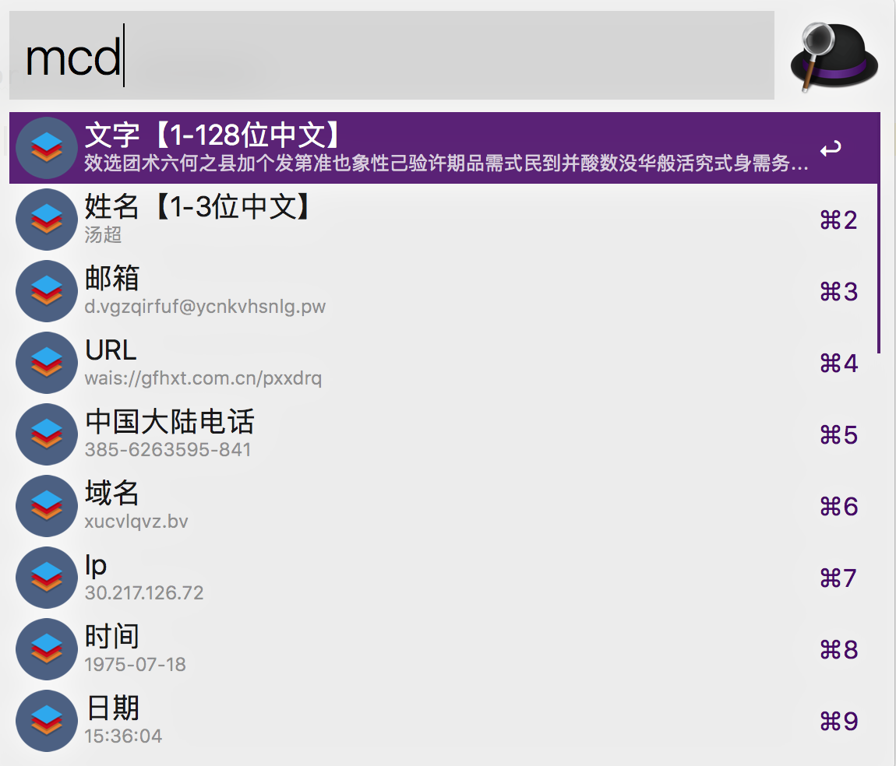
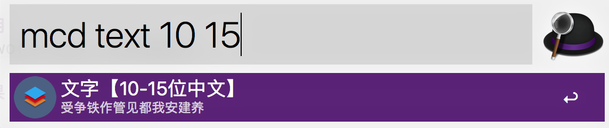

# Mock Data
开发基于 [mockjs](http://mockjs.com)

# 使用
下载 [Mock.Data.alfredworkflow](https://github.com/hiyangguo/mock-data/releases) 文件并运行; 

# 效果 

## 效果

## 支持检索

## 当前支持的列表
| 检索名 | 规则| 参数(默认值) |
| --- | --- | --- |
| text | 文字 | [`min`=1,`max`=128]|
| name | 姓名 | [`min`=1,`max`=4]|
| email | 邮箱 | -- |
| url |  URL | -- |
| phone | 电话号码 | -- |
| domain | 域名 | -- |
| ip |  Ip |-- ]|
| date |  日期 | `format` = `'yyyy-MM-dd'` |
| time | 时间 | `format`= `'HH:mm:ss'`|
| datetime | 日期时间 | `format`= `'yyyy-MM-dd HH:mm:ss'`|
| currency | 货币 | -- |
| province | 省份 | -- |
| city | 城市 | -- |
| county | 区县 | -- |
| guid |  guid | -- |
| paragraph | 英文段落 | `min` = `1`, `max` = `5` |
| sentence | 英文句子 | `min` = `1` |
| word | 英文单词 | `min` = `1` |
| title | 英文标题 | `min` = `2`, `max` = `5` |
| cparagraph | 中文段落 | `min` = `1` |
| csentence | 中文句子 | `min` = `1` |
| cword | 中文字 | `min` = `1` |
| ctitle | 中文标题 | `min` = `5`, `max` = `10` |
